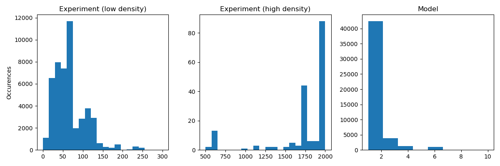
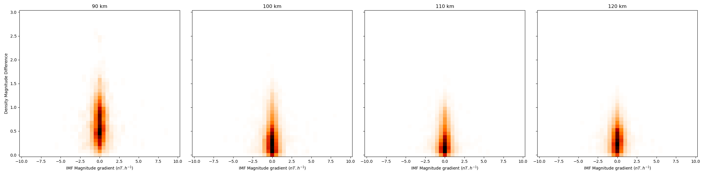
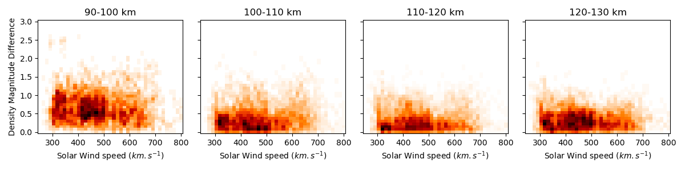
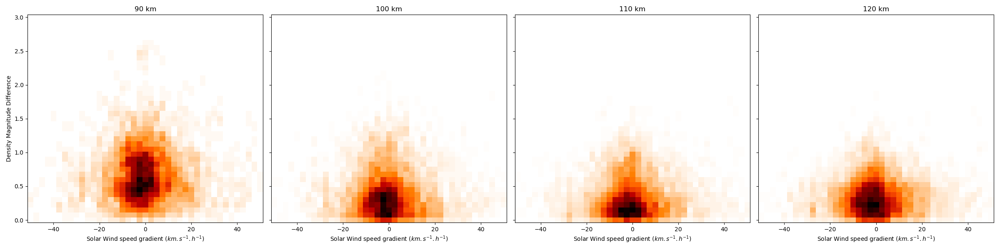
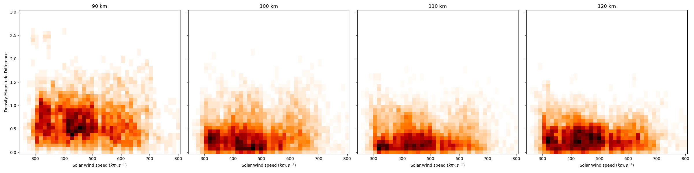
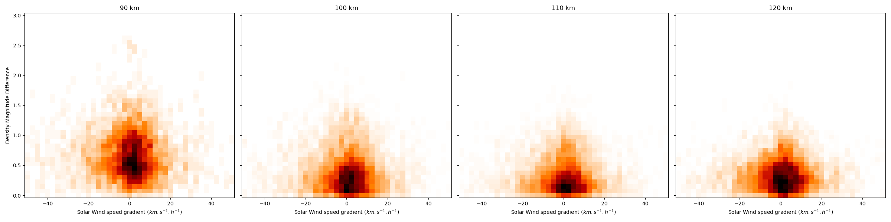

# Data Analysis
## Preamble
We study all experiments available on the years **2004**, **2008** and **2011** and for both **Svalbard Radar** and **Tromsø Radar**. We have **338** different experiments repartited on **278** different dates, with each **96** data points divided in **4 height interval** of 10 km each : **90-100 km**, **100-110 km**, **110-120 km** and **120-130km**. Each height interval is then subdivised in **24 time interval** of one hour each. The output file corresponding is `global_data_10_1.csv`, it is possible to use `global_data_10_0.5.csv` if more data points are needed, this file contains 2 times more time interval and so **192** data points. 

In reality we have more data points because each 10 km-1 hour interval, that we call bin from now one, is the mean value of either experiments value or modelisation within both range, this means that we have a lot more data point inside each bin.

  
  
<strong>Data point repartition - 10 km-1 hour bin</strong>

We can tell that we have more experiment Data Points, almost $3.5$ millions, than model data points, around $75,000$.

For the index analysis, we will both study the impact of the index itself and its gradient over time.

## Whole Data
### DST Index
First let's define the DST Index (*Disturbance Storm Time Index*) is an index of magnetic activity derived from a network of near-equatorial geomagnetic observatories that measures the intensity of the globally symmetrical equatorial electrojet (the "ring current").[^1]

  
  
<strong>Index Visualization - DST</strong>

Here we can see that the DST index value itself doesn't seem to impact on the error magnitude. We can indeed tell that the higher we are, the lower the error is.

  
  
<strong>Gradient Visualization - DST</strong>

The DST gradient is the only one that is not symetrical, we can clearly see that if the value is positive the error magnitude is way lower than if it is negative.

> [!IMPORTANT]
> Find more positive value of DST gradient to see if this behavior become more and more visible.
> 
> This might be hard to do because positive DST gradient dont go really high into positive as geomagnetic disturbance come back to normal state slowly compared top fast change when a geomagnetic storm occurs.

### Hp30 index
The geomagnetic Hp30 index is a Kp-like index with a time resolution of 30 minutes (another one exists with a time resolution of 60 minutes named Hp60). The main differences with Kp index is the time resolution (30 minutes against 3 hours) and the open scale for Hp30 compared to the capped at 9 Kp.[^2]

  
  
<strong> Comparison between indexes - Hp30 & DST</strong>

This plot shows that with Hpo indexes we get more precise informations about the magnitude of the geomagnetic event happening.

  
  
<strong>Index Visualization - Hp30</strong>

We can see a tendency for the error magnitude to be lower when the index is high, i.e. the geomagnetic storm is strong. 

> [!IMPORTANT]
> Add more different strong geomagnetic events to see if this tendency became more or less visible.
>
> It is possible to add either different years apart from 2004, 2008 and 2011 that I used in the first place, or different location for the known geomagnetic storms during these years.

  
  
<strong>Gradient Visualization - Hp30</strong>

Not a lot of things to say about the gradient, this is a common thing for all gradients beside the DST gradient.

### Auroral Electrojets Strength - SML, SMU & SME
The SML, SMU and SME indices describe the same phenomenon, the only difference is that SML measure maximun Westward strength, where SMU measures Eastward strength and SME is the difference between Eastward and Westward. Both come from stations between 40° and 80° magnetic north but SML is from the lower envelope and SMU the upper envelope.[^3]

  
  
  
<strong>Index Visualization - SMU & SML</strong>

We can see a lower error magnitude when the electrojet strength is high (positive for SMU and negative for SML).

  
  
<strong>Index Visualization - SME</strong>

The same analysis can be done for SME.

  
  
  
<strong>Gradient Visualization - SMU & SML</strong>

We can see that we have a really strong presence around zero, meaning that the gradient for these two indices are really low, but for any stronger gradient the error magnitude is still lower.

  
  
<strong>Gradient Visualization - SME</strong>

We can still tell that the height has an impact on the error magnitude, the higher the better, but we can also see that for high altitude we have a slope looking like $f(x) = A/|x|$.

> [!IMPORTANT]
> This assumption must be verified with more data from different year and/or observatories.

### Interplanetary Magnetic Field
The IMF is the Magnetic Field dragged out of the sun by the solar wind. [^4]

  
  
<strong>Index Visualization - IMF</strong>

We cannot see any obvious correlation between the error magniture and the IMF, same for its gradient.

  
  
<strong>Gradient Visualization - IMF</strong>

### Solar Wind speed 
Last thing we have checked is the Solar Wind speed, which is the speed of the wind when it enters the Magnetosphere.

  
  
  
<strong>Index & Gradient Visualization - Solar Wind speed</strong>

The only noticeable thing is that the gradient is not centered in 0, but this recenters when we take the solar wind speed one hour before.

> [!NOTE]
> We do this because we need to 'wait' for the wind to impact low altitude such as 100km where WACCM have its modelisations.
>
> 1 hour seems to be a good approximation, but we could try with 30 minutes too.

  
  
  
<strong>Index & Gradient Visualization - Solar Wind speed 1 hour before</strong>

With this work, we can already tell two things :
1. WACCM fits better at its highest altitude range, 110-120 km and 120-130 km.
2. WACCM fits better for high intensity solar events.

[^1]: [National Oceanic and Atmospheric Administration](https://www.ngdc.noaa.gov/stp/geomag/dst.html#:~:text=The%20Disturbance%20Storm%20Time%20Index,the%20%22ring%20current%22).)

[^2]: [Solar Influences Data Analysis Center](https://www.sidc.be/article/hpo)

[^3]: [SuperMAG](https://supermag.jhuapl.edu/indices/?fidelity=low&layers=SME.UL&start=2001-01-29T23%3A00%3A00.000Z&step=14400&tab=about)

[^4]: [National Aeronautics and Space Administration](https://solarscience.msfc.nasa.gov/people/suess/Interstellar_Probe/IMF/IMF.html)
