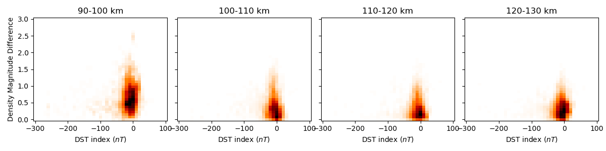
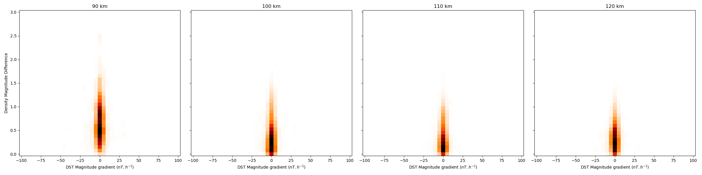
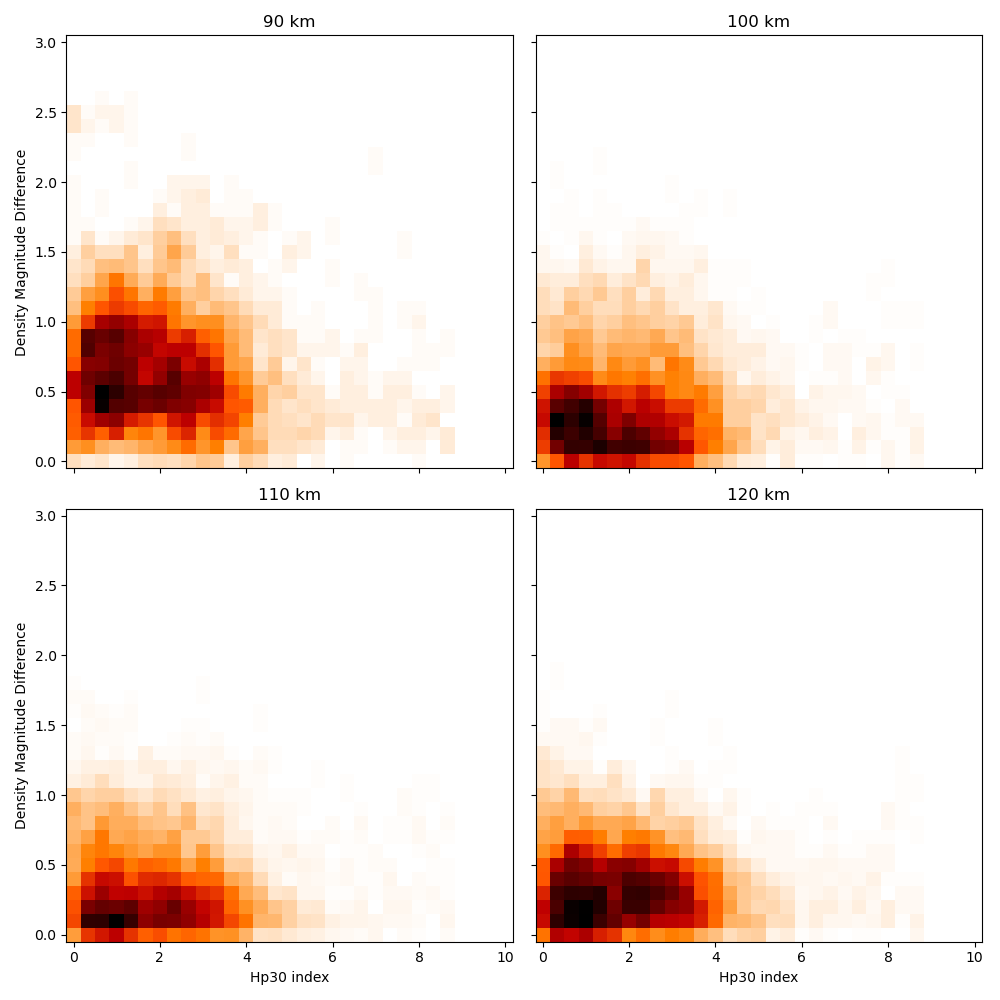
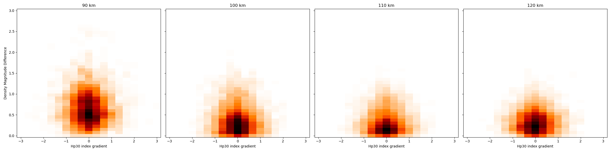

# Differences between Locations
First we can tell by looking at two plots (in `Output/Figures/`) comparing the same index that the two locations (Longyearbyen and Tromsø) have similar error magnitude for each height interval.

# Using the different indexes
For the analysis, we will both study the impact of the index itself and its gradient over time. We will also divide the measurements over 4 equals interval of 10 km in order to see the impact of the height on the error magnitude.

### DST Index
First let's define the DST Index (*Disturbance Storm Time Index*) is an index of magnetic activity derived from a network of near-equatorial geomagnetic observatories that measures the intensity of the globally symmetrical equatorial electrojet (the "ring current").[^1]

  

Here we can see that the DST index value itself doesn't seem to impact on the error magnitude. We can indeed tell that the higher we are, the lower the error is.

  

The DST gradient is the only one that is not symetrical, we can clearly see that if the value is positive the error magnitude is way lower than if it is negative.

> [!IMPORTANT]
> Find more positive value of DST gradient to see if this behavior become more and more visible.
> 
> This might be hard to do because positive DST gradient dont go really high into positive as geomagnetic disturbance come back to normal state slowly compared top fast change when a geomagnetic storm occurs.

### Hp30 index
The geomagnetic Hp30 index is a Kp-like index with a time resolution of 30 minutes (another one exists with a time resolution of 60 minutes named Hp60). The main differences with Kp index is the time resolution (30 minutes against 3 hours) and the open scale for Hp30 compared to the capped at 9 Kp.[^2]

  

This plot shows that with Hpo indexes we get more precise informations about the magnitude of the geomagnetic event happening.

  

We can see a tendency for the error magnitude to be lower when the index is high, i.e. the geomagnetic storm is strong. 

> [!IMPORTANT]
> Add more different strong geomagnetic events to see if this tendency became more or less visible.
>
> It is possible to add either different years apart from 2004, 2008 and 2011 that I used in the first place, or different location for the known geomagnetic storms during these years.

  

Not a lot of things to say about the gradient, this is a common thing for all gradients beside the DST gradient.

[^1]: [National Oceanic and Atmospheric Administration](https://www.ngdc.noaa.gov/stp/geomag/dst.html#:~:text=The%20Disturbance%20Storm%20Time%20Index,the%20%22ring%20current%22).)

[^2]: [Solar Influences Data Analysis Center](https://www.sidc.be/article/hpo)
