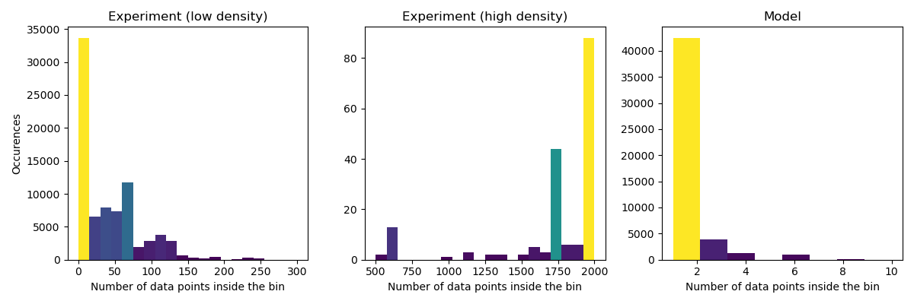
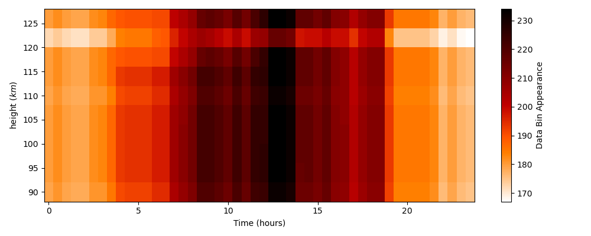
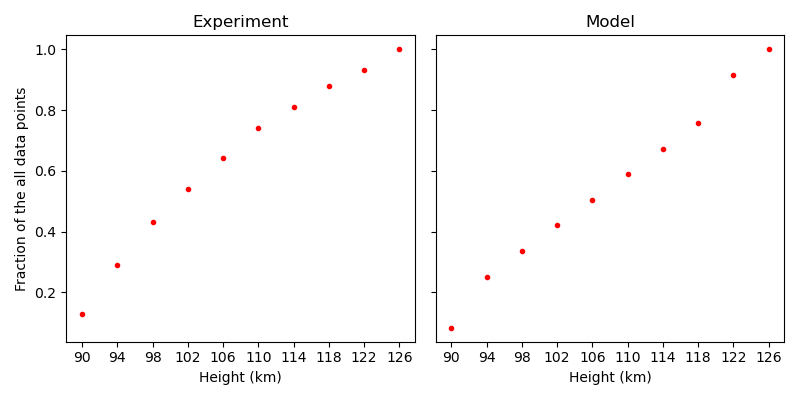
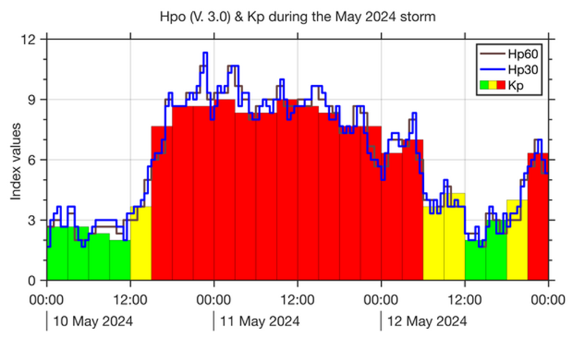

# Preamble
We study all experiments available on the years **2004**, **2008** and **2011** and for both **Svalbard Radar** and **Tromsø Radar**. We have **338** different experiments repartited on **278** different dates, with each **96** data bins divided in **4 height interval** of 10 km each : **90-100 km**, **100-110 km**, **110-120 km** and **120-130km**. Each height interval is then subdivided in **24 time interval** of one hour each, i.e. 32448 data bins in total. The output file corresponding is `global_data_10_1.csv`, it is possible to use `global_data_10_0.5.csv` if more data bins are needed, this file contains 2 times more time interval and so **192** data bins per day which rises the total number of data bins to 64896. 

In reality we have more data points because each 10 km-1 hour interval, that we call bin from now on, is the mean value of either experiments value or modelisation within both range, this means that we have a lot more data point inside each bin. We can then plot a histogram of the number of appearance of each density of data points. 

  
  
<strong>Data point repartition - 10 km/1 hour bin</strong>

We can see that most model bins have a density of 1 data point per bin ($DP/bins$) and most experiment bins have a density less than 200 $DP/bins$, but we have a non negligible amount of bins that have a high density (above 1500 $DP/bins$). Because of that, let's plot the cumulative amount of data points over the data point density.

  
  
<strong>Data point fraction summed - 10 km/1 hour bin</strong>

For the experiment nothing surprising, we have almost all data points before 300, but for the model we can see that the density of 1 $DP/bins$ only give around 40% of all the data points. let's get the 50%, 80% and 95% value for both bins type.

  <table>
    <tr>
      <th>Percentile</th>
      <td>50%</td>
      <td>80%</td>
      <td>90%</td>
      <td>95%</td>
    </tr>
    <tr>
      <th>Experiment</th>
      <td>90</td>
      <td>139</td>
      <td>240</td>
      <td>1892</td>
    </tr>
    <tr>
      <th>Model</th>
      <td>2</td>
      <td>3</td>
      <td>4</td>
      <td>6</td>
    </tr>
  </table>
  
<strong>Percentile value - Experiment and Model</strong>

This shows that even though almost all bins contains less than 300 Data Points but still 5% is above 1900 $DP/bins$ for the experiments.

In total we have more experiment Data Points, almost $3.5$ millions, than model Data Points, around $75,000$.

Then we can plot the sum of all data points within each bin in a 2D-histogram over height and time.

  
  
<strong>Data point appearance - 4 km/1 hour bin</strong>

This shows that for the model we have approximately a density of $1 \; DP/bins$ except for two specific height but this is because WACCM height interval is based on pressure so it is not exactly 4.

For the experiment, we can tell that we have more data points in low altitude, especially between 09:00 and 16:00.

We can also plot the frequency of appearance of each bin in a 2D-histogram over height and time.

  
  
<strong>Data bin appearance summed - 4 km/1 hour bin</strong>

We can see that in reality we don't have the same frequency everywhere on the grid data bins. Because of that we drop down our data bins count from 32448 to 19593. 

This histogram also shows that most of the experiments we uses are during active work hours (between 07:00 and 18:00), which is logical.

We can finally plot the mean density for each bin by simply dividing the first histogram by the second.

  
  
<strong>Data point mean density - 4 km/1 hour bin</strong>

This histogram is not a lot different from the one Data point sum density one, we still see the strong difference between high and low altitude for the experiment and the two strong lines for the model.

We can also plot an histogram to show the repartition for each height bin.

  
  
<strong>Data point repartition - 4 km bin</strong>

We do not see any strong difference in the height repartition for both histogram.

  
  
<strong>Data point repartition summed - 4 km bin</strong>

  <table>
    <tr>
      <th>Percentile</th>
      <td>50%</td>
      <td>80%</td>
      <td>90%</td>
      <td>95%</td>
    </tr>
    <tr>
      <th>Experiment</th>
      <td>102</td>
      <td>114</td>
      <td>122</td>
      <td>126</td>
    </tr>
    <tr>
      <th>Model</th>
      <td>106</td>
      <td>122</td>
      <td>122</td>
      <td>126</td>
    </tr>
  </table>
  
<strong>Percentile value - Experiment and Model</strong>

This shows that we get almost half of all data points in the first third of the height.

> [!NOTE]
> All previous plot were done with the whole dataset and will be redo for each case of analysis (besides in the whole data analysis)

# Dataset Analysis 
For the index analysis, we will both study the impact of the index itself and its gradient over time.

## Whole Dataset
To begin with, we will use all experiments available, both radar and both active and quiet day, to see if any of the indexes have clear impact on the error magnitude.

### DST Index
First let's define the DST Index (*Disturbance Storm Time Index*) is an index of magnetic activity derived from a network of near-equatorial geomagnetic observatories that measures the intensity of the globally symmetrical equatorial electrojet (the "ring current").[^1]

  
  
<strong>Index Visualization - DST</strong>

Here we can see that the DST index value itself doesn't seem to impact on the error magnitude. We can indeed tell that the higher we are, the lower the error is.

  
  
<strong>Gradient Visualization - DST</strong>

The DST gradient is the only one that is not symetrical, we can clearly see that if the value is positive the error magnitude is way lower than if it is negative.

> [!IMPORTANT]
> Find more positive value of DST gradient to see if this behavior become more and more visible.
> 
> This might be hard to do because positive DST gradient dont go really high into positive as geomagnetic disturbance come back to normal state slowly compared top fast change when a geomagnetic storm occurs.

### Hp30 index
The geomagnetic Hp30 index is a Kp-like index with a time resolution of 30 minutes (another one exists with a time resolution of 60 minutes named Hp60). The main differences with Kp index is the time resolution (30 minutes against 3 hours) and the open scale for Hp30 compared to the capped at 9 Kp.[^2]

  
  
<strong> Comparison between indexes - Hp30 & DST</strong>

This plot shows that with Hpo indexes we get more precise informations about the magnitude of the geomagnetic event happening.

  
  
<strong>Index Visualization - Hp30</strong>

We can see a tendency for the error magnitude to be lower when the index is high, i.e. the geomagnetic storm is strong. 

> [!IMPORTANT]
> Add more different strong geomagnetic events to see if this tendency became more or less visible.
>
> It is possible to add either different years apart from 2004, 2008 and 2011 that I used in the first place, or different location for the known geomagnetic storms during these years.

  
  
<strong>Gradient Visualization - Hp30</strong>

Not a lot of things to say about the gradient, this is a common thing for all gradients beside the DST gradient.

### Auroral Electrojets Strength - SML, SMU & SME
The SML, SMU and SME indices describe the same phenomenon, the only difference is that SML measure maximum Westward strength, where SMU measures Eastward strength and SME is the difference between Eastward and Westward. Both come from stations between 40° and 80° magnetic north but SML is from the lower envelope and SMU the upper envelope.[^3]

  
  
  
<strong>Index Visualization - SMU & SML</strong>

We can see a lower error magnitude when the electrojet strength is high (positive for SMU and negative for SML).

  
  
<strong>Index Visualization - SME</strong>

The same analysis can be done for SME.

  
  
  
<strong>Gradient Visualization - SMU & SML</strong>

We can see that we have a really strong presence around zero, meaning that the gradient for these two indices are really low, but for any stronger gradient the error magnitude is still lower.

  
  
<strong>Gradient Visualization - SME</strong>

We can still tell that the height has an impact on the error magnitude, the higher the better, but we can also see that for high altitude we have a slope looking like $f(x) = A/|x|$.

> [!IMPORTANT]
> This assumption must be verified with more data from different year and/or observatories.

### Interplanetary Magnetic Field
The IMF is the Magnetic Field dragged out of the sun by the solar wind. [^4]

  
  
<strong>Index Visualization - IMF</strong>

We cannot see any obvious correlation between the error magniture and the IMF, same for its gradient.

  
  
<strong>Gradient Visualization - IMF</strong>

### Solar Wind speed 
Last thing we have checked is the Solar Wind speed, which is the speed of the wind when it enters the Magnetosphere.

  
  
  
<strong>Index & Gradient Visualization - Solar Wind speed</strong>

The only noticeable thing is that the gradient is not centered in 0, but this recenters when we take the solar wind speed one hour before.

> [!NOTE]
> We do this because we need to 'wait' for the wind to impact low altitude such as 100km where WACCM have its modelisations.
>
> 1 hour seems to be a good approximation, but we could try with 30 minutes too.

  
  
  
<strong>Index & Gradient Visualization - Solar Wind speed 1 hour before</strong>

With this work, we can already tell two things :
1. WACCM fits better at its highest altitude range, 110-120 km and 120-130 km.
2. WACCM fits better for high intensity solar events.

[^1]: [National Oceanic and Atmospheric Administration](https://www.ngdc.noaa.gov/stp/geomag/dst.html))

[^2]: [Solar Influences Data Analysis Center](https://www.sidc.be/article/hpo)

[^3]: [SuperMAG](https://supermag.jhuapl.edu/indices/?fidelity=low&layers=SME.UL&start=2001-01-29T23%3A00%3A00.000Z&step=14400&tab=about)

[^4]: [National Aeronautics and Space Administration](https://solarscience.msfc.nasa.gov/people/suess/Interstellar_Probe/IMF/IMF.html)
